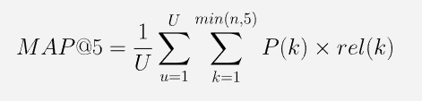

# 🥈HappyWhale - Dolphin and Whale

<div style="text-align:center"></div>
<br>

# Contents

#### &nbsp;&nbsp;&nbsp;&nbsp;**[🧐Task Description](https://github.com/YDdreammaker/dl_whale_classification#task-description-1)**

#### &nbsp;&nbsp;&nbsp;&nbsp;**[🏆Project Result](https://github.com/YDdreammaker/dl_whale_classification#project-result-1)**

#### &nbsp;&nbsp;&nbsp;&nbsp;**[⚙Installation](https://github.com/YDdreammaker/dl_whale_classification#installation-1)**

#### &nbsp;&nbsp;&nbsp;&nbsp;**[🕹Command Line Interface](https://github.com/YDdreammaker/dl_whale_classification#command-line-interface-1)**

#### &nbsp;&nbsp;&nbsp;&nbsp;**[🤝Collaboration Tools](https://github.com/YDdreammaker/dl_whale_classification#collaboration-tools-1)**

#### &nbsp;&nbsp;&nbsp;&nbsp;**[👩‍👦‍👦Who Are We?](https://github.com/YDdreammaker/dl_whale_classification#who-are-we-1)**
<br>

# Task Description

### Subject https://www.kaggle.com/competitions/happy-whale-and-dolphin 
<br>
이번 대회의 주제는 돌고래와 고래의 사진으로 individual_id 분류하는 문제였습니다.  돌고래와 고래의 지느러미에 사람의 지문과 같이 각 개체를 분류할 수 있는 특징이 있다고 생각해 해당 문제를 object recognition 이론으로 접근하였습니다.

<br>
돌고래의 사진을 지느러미와 지느러미를 포함한 몸통으로 object detection 진행하고, 해당 이미지를 가지고 각 개체를 분류하는 모델을 생성하였습니다.
<br>

### Data

- 훈련 데이터 : 51033장의 이미지와 해당 이미지의 종과 individual_id

- 테스트 데이터 : 27916장의 이미지
<br>

### Metric


</br>


</br>

# Project Result

<div></div>

- 은메달 47 등 / 1,613 팀

- Public LB Score: 0.85147 / Private LB Score: 0.81686

- 솔루션은 [이곳](https://www.notion.so/Solution-3ccc8fd2a39841a78d5726946b109707)에서 확인하실 수 있습니다.
</br>

# Installation

```bash
# clone repository
git clone https://github.com/YDdreammaker/dl_whale_classification.git

# install necessary tools
pip install -r requirements.txt
```

### Dataset Structure

```shell
[dataset]/
├── train.csv
├── sample_submission.csv
├── train/
    ├── *.jpg
    ├── ...
    └── *.jpg
└── test/
    ├── *.jpg
    ├── ...
    └── *.jpg
```

### Code Structure

```shell
[code]
├── data.py/ # modules for dataset
├── loss.py/ # modules for loss during train
├── schedulers.py/ # Cosine Annealing Warmup scheduler
├── utils.py/ # useful utilities
├── model.py/ # modules for model during train
├── train.py/ # modules for train and validation of one epoch
├── README.md
├── requirements.txt
├── main.py
└── inference.py
```


# Command Line Interface

## Train

```bash
$ python main.py --n_split \
                 --fold \
                 --seed \
                 --epoch \
                 --model_name \
                 --train_data \
                 --train_image_root \
                 --image_size \
                 --batch_size \
                 --iters_to_accumulate \
                 --learning_rate \         # max learning rate for scheduler
                 --emb_size \              # embedding size
                 --margin \
                 --s \                    # ArcFace parameter
                 --m \                    # ArcFace parameter
                 --weight_decay \
                 --experiment \           # for keep training for ex-train
```

## Inference

#### make embedding pt file
```shell
$ python inference.py --inference_type embedding
```

#### make logit pt file
```shell
$ python inference.py --inference_type logit
```
</br>

# Collaboration Tools
<table>
    <tr height="200px">
        <td align="center" width="350px">	
            <a href="https://www.notion.so/b47246b96c204ca38f96c45888919525?v=f2ab615cde7342c78d3761641a828e5c"></a>
            <br />
            <a href="https://www.notion.so/b47246b96c204ca38f96c45888919525?v=f2ab615cde7342c78d3761641a828e5c">Notion</a>
        </td>
        <td align="center" width="350px">	
            <a></a>
            <br />
            <a>WanDB</a>
        </td>
    </tr>
</table>
</br>

# Who Are We?

<table>
    <tr height="140px">
        <td align="center" width="130px">	
            <a href="https://github.com/DaeYeongMonster"></a>
            <br />
            <a href="https://github.com/DaeYeongMonster">김대영<br />eodudahs@gmail.com</a>
        </td>
        <td align="center" width="130px">
            <a href="https://github.com/ahaampo5"></a>
            <br />
            <a href="https://github.com/ahaampo5">김준철<br />ahaampo5@gmail.com</a>
        </td>
        <td align="center" width="130px">
            <a href="https://github.com/thsckdduq"></a>
            <br />
            <a href="https://github.com/thsckdduq">손창엽<br />thsckdduq@gmail.com</a>
        </td>
    </tr>
    <tr height="140px">
        <td align="center" width="130px">
            <a href="https://github.com/NOTITLEUNTITLE"></a>
            <br />
            <a href="https://github.com/NOTITLEUNTITLE">용다운<br />inopiction@naver.com</a>
        </td>
        <td align="center" width="130px">
            <a href="https://github.com/aperyear"></a>
            <br />
            <a href="https://github.com/aperyear">이남주<br />aperyear@gmail.com</a>
        </td>
    </tr>
</table>